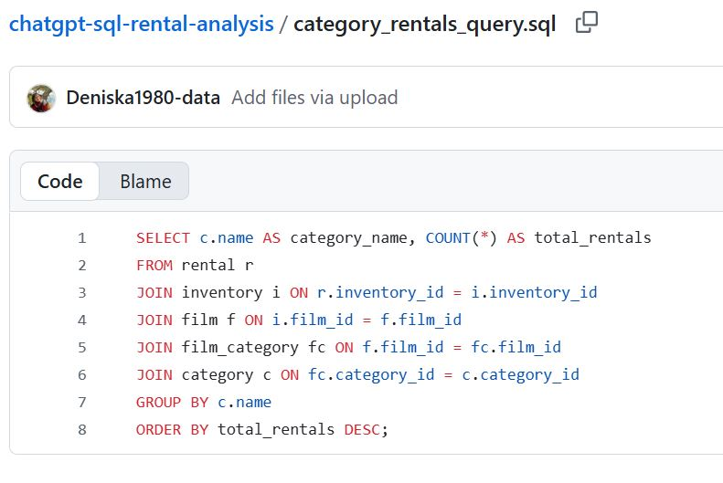

This project explores how ChatGPT can assist in writing and analyzing SQL queries using a sample MySQL movie rental database. The goal was to practice prompt engineering and understand database structure by answering business-relevant analytical questions.

## Project Highlights

- **Practical SQL Training** – Wrote and validated SQL queries on a movie rental database (MySQL schema).  
- **Prompt Engineering with AI** – Used ChatGPT to generate and refine SQL queries based on structured prompts.  
- **Business-Relevant Analysis** – Focused on identifying top-performing movie categories and rental trends.  
- **Validation Process** – Compared generated queries with schema to ensure correctness and reliability.  
- **Visual Documentation** – Added query screenshots and results for better clarity and portfolio presentation.  
- **Bilingual Project** – Documentation available in both English and Czech for broader accessibility.

## Hlavní přínosy projektu

- **Praktický trénink SQL** – Napsání a ověření SQL dotazů nad databází půjčovny filmů (MySQL schema).  
- **Prompt engineering s AI** – Využití ChatGPT pro generování a zpřesnění SQL dotazů na základě strukturovaných promptů.  
- **Obchodně relevantní analýza** – Zaměření na identifikaci nejvýkonnějších filmových kategorií a trendů v půjčování.  
- **Proces validace** – Porovnání vygenerovaných dotazů se schématem pro zajištění správnosti a spolehlivosti.  
- **Vizuální dokumentace** – Doplnění screenshotů dotazů a výsledků pro lepší přehlednost a prezentaci v portfoliu.  
- **Dvojjazyčný projekt** – Dokumentace dostupná v angličtině i češtině pro širší publikum.  

Objectives:
Practice prompt engineering using AI (ChatGPT)
Generate realistic business questions based on a movie rental schema
Use SQL to answer those questions
Validate query correctness

Explore an experimental method for structured prompt-query building

Sample Prompts and Output
This repository includes:
a) 4 structured prompt examples (based on different questioning techniques)
b) Validated SQL query that identifies top-performing movie categories
c) Experimental prompting method for query generation

### Python (pandas) Example

EN: Example of analyzing movie rental data with pandas. The dataset is grouped by film category to count total rentals, similar to the SQL query.
CZ: Ukázka analýzy dat o půjčovnách filmů pomocí pandas. Dataset je seskupen podle filmové kategorie pro výpočet počtu půjčoven, podobně jako SQL dotaz.

import pandas as pd
# Small dataset similar to Sakila
```python
data = {
    "category": ["Action", "Comedy", "Drama", "Action", "Drama", "Comedy", "Action", "Drama", "Comedy", "Action"],
    "rental_id": [1,2,3,4,5,6,7,8,9,10]}
df = pd.DataFrame(data)

## Rentals by category
rentals_by_category = df.groupby("category")["rental_id"].count().reset_index()
rentals_by_category = rentals_by_category.rename(columns={"rental_id": "total_rentals"})
print(rentals_by_category)

| category | total_rentals |
| -------- | ------------- |
| Action   | 4             |
| Comedy   | 3             |
| Drama    | 3             |

import pandas as pd
```python
df_with_totals = df.merge(rentals_by_category, on="category")
print(df_with_totals)

   category  rental_id  total_rentals
0   Action          1              4
1   Comedy          2              3
2   Drama           3              3
3   Action          4              4
4   Drama           5              3
5   Comedy          6              3
6   Action          7              4
7   Drama           8              3
8   Comedy          9              3
9   Action         10              4

## Key SQL Query Example

SELECT c.name AS category_name, COUNT(*) AS total_rentals  
FROM rental r  
JOIN inventory i ON r.inventory_id = i.inventory_id  
JOIN film f ON i.film_id = f.film_id  
JOIN film_category fc ON f.film_id = fc.film_id  
JOIN category c ON fc.category_id = c.category_id  
GROUP BY c.name  
ORDER BY total_rentals DESC;

This query identifies the most rented movie categories.
### Visualization





This was a guided exercise in combining LLMs + SQL for learning and analysis. It’s part of my training toward a Junior Data Analyst role, focusing on building practical skills with tools like SQL, ChatGPT, and MySQL. 

